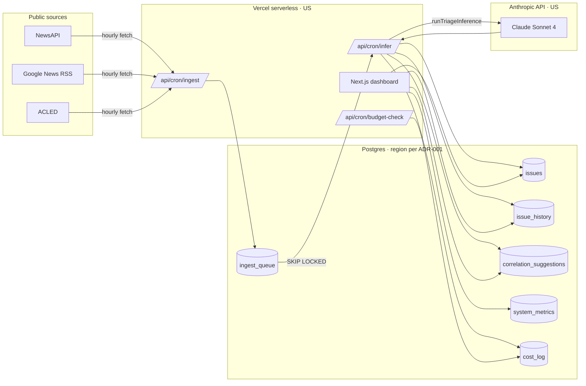

# Artifact 1 — System Architecture + Data-Flow Diagrams

**Status**: 🚧 prose done; PNG/SVG diagrams pending
**Spec ref**: §10 item 1, §6.1

## What this artifact is

Two diagrams + accompanying prose:

1. **Layered architecture** — Sources / Queue / Inference / Correlation /
   Storage / Management / Delivery. One block per layer; arrows for
   data direction.
2. **Data flow for a single article** — from source fetch through
   queue claim, Claude call, Issue creation, correlation suggestion,
   HITL handling, and (separately) cost logging.

## What we have today

- Prose architecture in `docs/architecture.md`.
- ASCII data-flow sketch in the spec (§6.2).
- All layer code is grep-traceable via the section-tag comments at
  the top of every `lib/` file.

## What's missing

- Actual PNG/SVG diagrams. The TSMC reviewer wants something they can
  paste into a slide deck.
- A boundary annotation distinguishing: what runs in browser, what
  runs in Vercel serverless, what runs in Postgres, what calls
  Anthropic.
- Trust boundary labels (where untrusted input enters, where authz
  enforcement sits).

## How to produce

1. Use **Mermaid** in this file (renders in GitHub natively, no tool
   chain needed) — see template below.
2. Export to PNG for the audit packet via `mmdc` or the Mermaid Live
   Editor.
3. Update §STATUS row 1 to ✅.

## Mermaid template (fill in before sending to audit)

